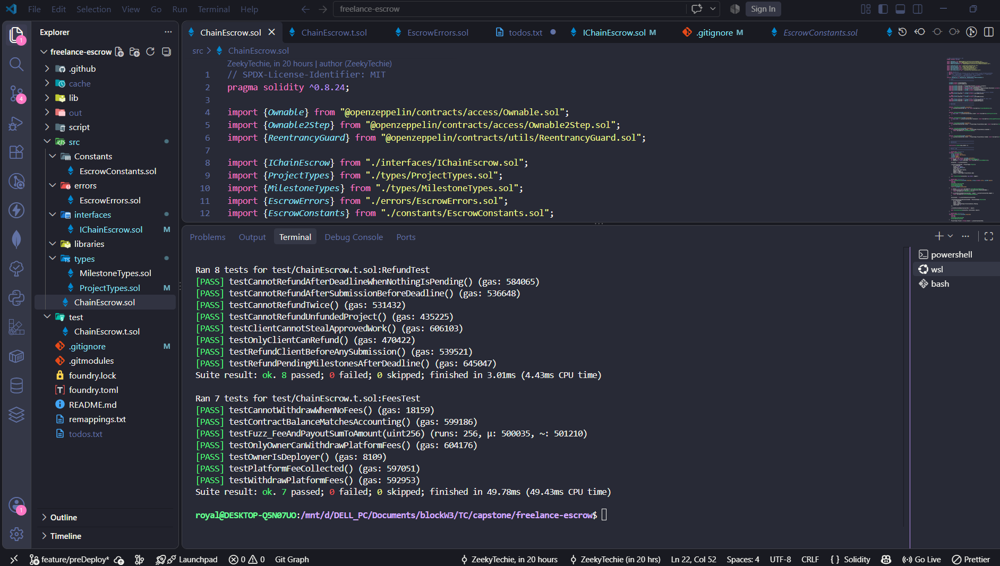
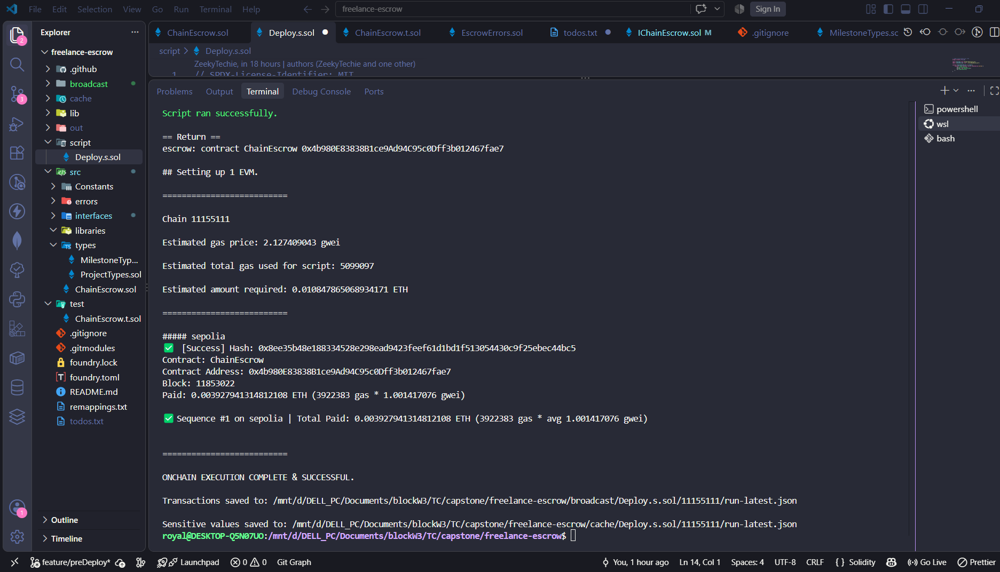

# Freelance ChainEscrow Capstone Project

A milestone-based freelance escrow smart contract built on Ethereum in which clients and freelancers can agree on work, lock funds in escrow, and release payment as milestones are completed. The contract removes the need for a centralized middleman and gives both sides clear rules for how funds move

This project was built as part of our TC Blockchain & Web3 capstone project

---

## Main Features

ChainEscrow lets a client post a freelance project with a total budget and a deadline. The client then splits that budget into milestones. A freelancer reviews the project, accepts it, and the client funds the escrow with the full budget. From there, the freelancer submits milestones as work is completed, the client reviews and approves them, and payment is released automatically

If something goes wrong, either side has options. The client can open a dispute on a submitted milestone, and the platform owner (acting as an arbiter) resolves it. If the freelancer disappears after accepting, the client can refund any milestones that were never started, once the deadline has passed. If the client ignores a submitted milestone for too long, the freelancer can claim payment automatically after a review period

The contract also collects a small platform fee on every milestone paid out. The owner can withdraw these accumulated fees at any time.

---

## How the Flow Works

The lifecycle of a project is:

1. Client creates a project with a title, description, budget, and deadline
2. Client adds milestones. The sum of all milestones must equal the project budget before the freelancer can accept
3. Freelancer accepts the project. Terms are now locked
4. Client funds the project with the exact budget amount in ETH
5. Freelancer submits milestones as they are completed
6. Client approves each submitted milestone
7. Either the client or the freelancer can trigger payment for an approved milestone. Funds are released to the freelancer, minus the platform fee
8. When all milestones are either paid or cancelled, the project is marked Completed or Cancelled automatically

If the client rejects a submitted milestone, they can open a dispute. The owner resolves the dispute by deciding whether to pay the freelancer or refund the client.

If the freelancer submits a milestone but the client never responds, the freelancer can claim payment after a review period of seven days.

If the freelancer accepts a project but never delivers, the client can refund any pending milestones once the deadline has passed.

The deadline can also be extended if both parties agree. Either side can propose a new deadline, and the other side must accept it before it takes effect.

---

## Key Features

- Milestone-based payments so clients only pay for completed work
- Full escrow of the project budget before work begins
- Deadline extensions with mutual agreement
- Dispute resolution handled by the platform owner
- Automatic payment claim if the client ignores a submission for a review period
- Refunds for unstarted milestones after the deadline
- Platform fee on every paid milestone
- Reentrancy protection on all ETH transfers
- Custom errors throughout for gas efficiency and clearer debugging
- Two-step ownership transfer with renounce disabled, so the arbiter role cannot be accidentally lost

---

## Platform Fee

Every milestone payment takes a 5 percent platform fee, calculated in basis points. The freelancer receives the remaining amount. Fees accumulate in the contract and can be withdrawn by the owner

---

## Security Considerations

The contract was written with a few well known Ethereum attack vectors in mind.

Reentrancy is guarded on all functions that send ETH. The contract uses OpenZeppelin's ReentrancyGuard and follows the checks-effects-interactions pattern, so state is always updated before any external call.

Access control is enforced through modifiers. Only the client can create milestones, approve work, or refund. Only the assigned freelancer can submit work or claim payment after the review period. Only the owner can resolve disputes or withdraw platform fees.

The ownership transfer is two-step, meaning a new owner must explicitly accept the role. Renouncing ownership is disabled, because losing the owner would lock dispute resolution and platform fee withdrawals permanently.

All ETH transfers use low level calls with a success check, and failures revert cleanly so no funds are lost.

---

## Testing

The project includes a test suite written in Foundry. Tests are split into logical groups covering the project lifecycle, milestone flow, refunds, disputes, deadline extensions, platform fees, ownership behaviour, and adversarial scenarios.

Malicious contract tests verify that reentrancy attempts fail and that recipients who reject ETH do not cause funds to be stuck. Fuzz testing confirms that the platform fee and freelancer payout always sum to the milestone amount with no wei lost.

To run the tests:
`forge test`

***All Test Pass***

## Deployment

The contract is deployed on the Sepolia testnet

- Contract Address: `0x4b980E83838B1ce9Ad94C95c0Dff3b012467fae7`
- Etherscan: https://sepolia.etherscan.io/address/0x4b980E83838B1ce9Ad94C95c0Dff3b012467fae7
- Network: Sepolia 
- Deployer: `0xD8304d643FC223f1E086f0B7C5D64Ec68B52f1EC`

## How to Build and Deploy

Clone the repository and install dependencies:
`forge install foundry-rs/forge-std`
`forge install OpenZeppelin/openzeppelin-contracts`

Build the project:
`forge build`

Run the test suite:
`forge test`

Deploy to Sepolia:

---

## Built With
- Solidity 0.8.24
- Foundry
- OpenZeppelin Contracts
- Git and GitHub

---

## Team
Built as a TCC8 group capstone project for Web3 & Blockchain development

--- 

## License
MIT
